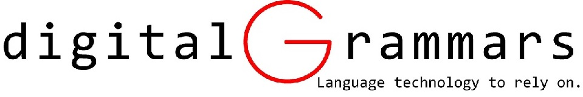
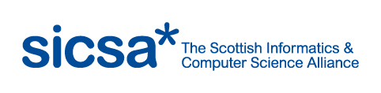

25–26 July 2016 — Aberdeen, Scotland

<a href="cnl2016.html">Main</a> | <a href="cnl2016program.html">Program</a> | <a href="cnl2016speakers.html">Invited Speakers</a> | <a href="cnl2016pd.html">Posters/Demos</a> | <a href="cnl2016info.html">Info for Participants</a> | <a href="cnl2016SM.html">Social Media</a> 

This workshop on [Controlled Natural Language (CNL)](index.html) has a broad
scope and embraces all approaches that are based on natural language and apply
restrictions on vocabulary, grammar, and/or semantics. This includes (but is
certainly not limited to) approaches that have been called _simplified language,
plain language, formalized language, processable language, fragments of
language, phraseologies, conceptual authoring, language generation, and guided
natural language interfaces_.

Some CNLs are designed to improve communication among humans, especially for
non-native speakers of the respective natural language. In other cases, the
restrictions on the language are supposed to make it easier for computers to
analyze such texts in order to improve computer-aided, semi-automatic, or
automatic translations into other languages. A third group of CNL has the goal
to enable reliable automated reasoning and formal knowledge representation from
seemingly natural texts. All these types of CNL are covered by this workshop.

### Important Dates

- REVISED EXTENDED SUBMISSION DEADLINE: 15 April 2016
- Notification of acceptance: 1 May 2016
- Deadline for receipt of revised papers: 13 May 2016
- Deadline for submission to Springer: 20 May 2016
- Early bird registration deadline until: 17 July 2016
- Late registration: 18-26 July 2016
- Posters/demos deadline: 11 July 2016
- Workshop: 25–26 July 2016

### Sponsors

_(contact Adam Wyner, azwyner@abdn.ac.uk, if you want to become a sponsor)_

### Topics

Possible topics for CNL 2016 include:

- CNL for knowledge representation
- CNL for query interfaces
- CNL for specifications
- CNL for business rules
- CNL for dialogue systems
- CNL for machine translation
- CNL for improved understandability of texts
- CNL for natural language generation
- design of CNLs
- CNL applications
- CNL evaluation
- usability and acceptance of CNL
- CNL grammars and lexica
- multilingual CNLs
- reasoning in CNL
- spoken CNL
- CNL in the context of the Semantic Web and Linked Open Data
- CNL in the government
- CNL in industry
- CNL use cases
- theoretical properties of CNL

### Submissions and Proceedings

We invite researchers to submit papers with novel contributions in the area of CNL. These research papers should be formatted according to the  [Springer LNCS format](https://www.springer.com/computer/lncs?SGWID=0-164-6-793341-0). You may submit a long paper (10 pages), a short paper (5 pages), or a position paper (2 pages with no abstract).

Submit your paper via Easychair:  [https://easychair.org/conferences/?conf=cnl2016](https://easychair.org/conferences/?conf=cnl2016)

The proceedings of the workshop is now published online [http://link.springer.com/openurl.asp?genre=issue&issn=0302-9743&volume=9767] under Springer’s LNCS/LNAI series and will be indexed in all major citation databases including ISI Web of Science and Scopus.

### Registration

The registration fee includes costs for running the workshop beyond those provided by our sponsors. Early bird registration fees: standard is £120; student is £60; SICSA affiliate is £0. From 18th July, the registration fees are: £160, £80, and £0, respectively. Please note that SICSA Affiliates are students or staff at a Scottish University; there is further information on the registration site. When applying for the student or SICSA fee, please provide suporting evidence to the local organiser.

[Register for the Workshop on this link](http://www.store.abdn.ac.uk/browse/extra_info.asp?compid=1&modid=2&deptid=54&catid=45&prodid=274)

### Organization Committee

- Adam Wyner (University of Aberdeen, Scotland; azwyner@abdn.ac.uk). Local organiser.
- Brian Davis (INSIGHT@NUI Galway, Ireland; brian.davis@insight-centre.org)
- Gordon Pace (University of Malta, Malta; gordon.pace@um.edu.mt)

### Program Committee

<ul>
<li>Krasimir Angelov (Chalmers University, Sweden)</li>
<li>Paul Buitelaar (INSIGHT@NUI Galway, formerly DERI, Ireland)</li>
<li>Rogan Creswick (Galois, USA)</li>
<li>Brian Davis (INSIGHT@NUI Galway, formerly DERI, Ireland)</li>
<li>Ronald Denaux (iSOCO, Spain)</li>
<li>Ramona Enache (Chalmers University, Sweden)</li>
<li>Esra Erdem (Sabanci University, Turkey)</li>
<li>S&eacute;bastien Ferr&eacute; (University Rennes 1, France)</li>
<li>Norbert E. Fuchs (University of Zurich, Switzerland)</li>
<li>Normunds Gr&#363;z&#299;tis (University of Latvia)</li>
<li>Kaarel Kaljurand (Nuance Communications, Austria)</li>
<li>Peter Koepke (University of Bonn, Germany)</li>
<li>Tobias Kuhn (ETH Zurich, Switzerland)</li>
<li>Adegboyega Ojo (INSIGHT@NUI Galway, formerly DERI, Ireland)</li>
<li>Gordon Pace (University of Malta)</li>
<li>Laurette Pretorius (University of South Africa)</li>
<li>Aarne Ranta (University of Gothenburg, Sweden)</li>
<li>Mike Rosner (University of Malta)</li>
<li>Uta Schwertel (imc, Germany)</li>
<li>Rolf Schwitter (Macquarie University, Australia)</li>
<li>Geoff Sutcliffe (University of Miami, USA)</li>
<li>Irina Temnikova (Qatar Computing Research Institute, Qatar)</li>
<li>Camilo Thorne (Free University of Bozen-Bolzano, Italy)</li>
<li>Jeroen Van Grondelle (HU University of Applied Sciences Utrecht, Netherlands)</li>
<li>Adam Wyner (University of Aberdeen, UK)</li>
</ul>

### Subreviewers
<ul>
<li>Hazem Safwat (INSIGHT@NUI Galway, formerly DERI, Ireland)</li>
<li>Sapna Negi  (INSIGHT@NUI Galway, formerly DERI, Ireland)</li>
</ul>

### Previous Events

There were four previous events in the same series:

- [CNL 2009](http://attempto.ifi.uzh.ch/site/cnl2009/) in Marettimo, Italy
- [CNL 2010](http://staff.um.edu.mt/mros1/cnl2010/index.html) in Marettimo, Italy
- [CNL 2012](http://attempto.ifi.uzh.ch/site/cnl2012/) in Zurich, Switzerland
- [CNL 2014](http://attempto.ifi.uzh.ch/site/cnl2014/) in Galway, Ireland
