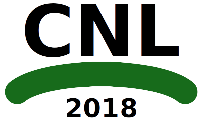
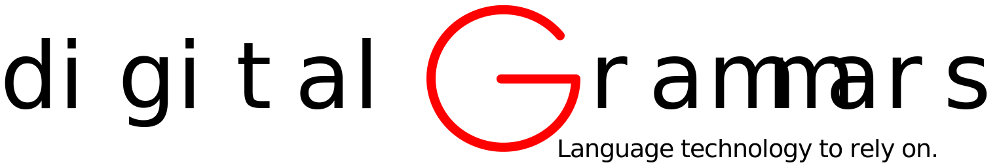
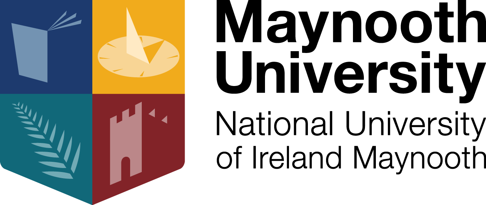

<a href="cnl2018program.html">Program</a> | <a href="cnl2018pd.html">Posters/Demos</a> | <a href="cnl2018speakers.html">Invited Speakers</a>  | <a href="cnl2018info.html">Info for Participants</a> | <a href="cnl2018SM.html">Social Media</a>

CNL 2018: Sixth International Workshop on Controlled Natural Language (CNL 2018)

27-28 August 2018 — Maynooth, Co Kildare (near Dublin), Ireland

<a href="http://ebooks.iospress.nl/volume/controlled-natural-language-proceedings-of-the-sixth-international-workshop-cnl-2018-maynooth-co-kildare-ireland-august-27-28-2018"> The proceedings are now available online under Open Access by IOS press for download!</a>

Sponsors:

This workshop on [Controlled Natural Language (CNL)](index.html) has a broad scope and embraces all approaches that are based on natural language and apply restrictions on vocabulary, grammar, and/or semantics. This includes (but is certainly not limited to) approaches that have been called _simplified language, plain language, formalized language, processable language, fragments of language, phraseologies, conceptual authoring, language generation, and guided natural language interfaces_.

Some CNLs are designed to improve communication among humans, especially for non-native speakers of the respective natural language. In other cases, the restrictions on the language are supposed to make it easier for computers to analyze such texts in order to improve computer-aided, semi-automatic, or automatic translations into other languages. A third group of CNL has the goal to enable reliable automated reasoning and formal knowledge representation from seemingly natural texts. All these types of CNL are covered by this workshop. In particular, we would like to emphasise that this year, we very much welcome contributions from Industry.

### Important Dates

- submission deadline (extended): 29 April 2018
- notification of acceptance: 30 May 2018
- deadline for revised papers: 17 June 2018
- deadline for abstracts of late breaking results: 15 July 2018
- registration deadline: 1 August 2018
- workshop: 27-28 August 2018

### Topics

Possible topics for CNL 2016 include:

- CNL for knowledge representation
- CNL for query interfaces
- CNL for specifications
- CNL for business rules
- CNL for dialogue systems
- CNL for machine translation
- CNL for improved understandability of texts
- CNL for natural language generation
- design of CNLs
- CNL applications
- CNL evaluation
- usability and acceptance of CNL
- CNL grammars and lexica
- multilingual CNLs
- reasoning in CNL
- spoken CNL
- CNL in the context of the Semantic Web and Linked Open Data
- CNL in the government
- CNL in industry
- CNL use cases
- theoretical properties of CNL

### Submissions and Proceedings

We invite researchers to submit papers with novel contributions in the area of CNL. You may submit a long paper (8 pages + 1 page references), a short paper (4 pages), or demonstration/position papers (2 pages extended abstract describing systems or work in progress; in order to save space, these ought not use the ‘abstract’ section of the template). Submissions should be formatted according to the templates that can be found here: [http://www.frontiersinai.com/?q=templates](http://www.frontiersinai.com/?q=templates)

Late breaking results can be submitted as abstracts of no more than 300 words, and can be presented at the workshop in the form of a poster, demo, and/or flash talk. The accepted abstracts will be listed on the website and will be given a 5 minute presentation slot prior to the poster/demo session of the workshop.

### Submit your paper via Easychair:

Submit your paper here: [https://easychair.org/conferences/?conf=cnl2018](https://easychair.org/conferences/?conf=cnl2018)

The proceedings of the workshop were published under Open Access publications in the book series [Frontiers in Artificial Intelligence and Applications](http://www.frontiersinai.com/) by IOS Press.  They are now available online for download [here.](http://ebooks.iospress.nl/volume/controlled-natural-language-proceedings-of-the-sixth-international-workshop-cnl-2018-maynooth-co-kildare-ireland-august-27-28-2018)

The abstracts for late breaking results should be submitted through the same submission link as above, but will not be included in the proceedings.

### Organization Committee

- Brian Davis (Maynooth, Co Kildare, Ireland; brian.davis@insight-centre.org)
- Adam Wyner (University of Aberdeen, Scotland; azwyner@gmail.com)
- Maria Keet (University of Cape Town, South Africa; mkeet@cs.uct.ac.za)

### Program Committee

- Krasimir Angelov (Digital Grammars, Sweden)
- Ramona Enache (Microsoft, Sweden)
- Ronald Denaux, (Expert System, Spain)
- Esra Erdem (Sabanci University, Turkey)
- Sebastien Ferre (University Rennes 1, France)
- Norbert E. Fuchs  (University of Zurich)
- Normunds Gruzitis (University of Latvia)
- Siegfried Handschuh (University of Passau, Germany)
- Kaarel Kaljurand (Nuance Communications, Austria)
- Tobias Kuhn (VU Amsterdam, The Netherlands)
- Gordon Pace (University of Malta)
- Laurette Pretorius (University of South Africa, South Africa)
- Sharon O'Brien (Adapt, Dublin City University, Ireland)
- John P. McCrae (Insight Centre for Data Analytics, National University of Ireland, Galway)
- Silvie Spreeuwenberg (LibRT, Netherlands)
- Rolf Schwitter (Macquarie University, Australia)
- Irina Temnikova (Qatar Computing Research Institute, Qatar)
- Mike Rosner (University of Malta)
- Mihael	Arcan (Insight Centre for Data Analytics, National University of Ireland, Galway)
- Camilo Thorne (IMS Stuttgart, University of Stuttgart, Germany)
- Peter	Koepke	(University of Bonn, Germany)
- John Camilleri (Digital Grammars, Sweden)

### Previous Events

There were four previous events in the same series:

- [CNL 2009](http://attempto.ifi.uzh.ch/site/cnl2009/) in Marettimo, Italy
- [CNL 2010](http://staff.um.edu.mt/mros1/cnl2010/index.html) in Marettimo, Italy
- [CNL 2012](http://attempto.ifi.uzh.ch/site/cnl2012/) in Zurich, Switzerland
- [CNL 2014](http://attempto.ifi.uzh.ch/site/cnl2014/) in Galway, Ireland
- [CNL 2016](http://www.sigcnl.org/cnl2016.html) in Aberdeen, Scotland
