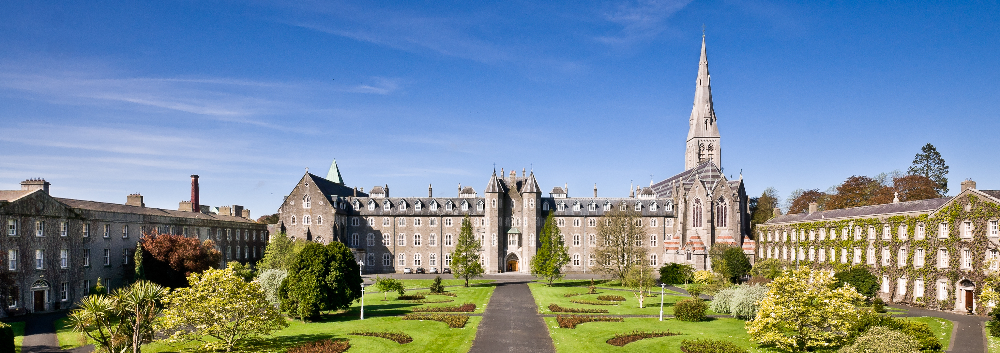

<a href="cnl2018.html">Main</a> | <a href="cnl2018program.html">Program</a> | <a href="cnl2018speakers.html">Invited Speakers</a> | <a href="cnl2018SM.html">Social Media</a>

CNL 2018: Sixth International Workshop on Controlled Natural Language (CNL 2018)

27-28 August 2018 — Maynooth, Co Kildare (near Dublin), Ireland

### Registration

TBD

### Venue

The workshop takes place in Ireland at the National University of Ireland, Maynooth. It will be held in Renahan Hill on the South Campus ([Number 13 on this map](https://www.maynoothuniversity.ie/campus-life/campus-map))

### Accommodation

Accomodation has to be organized individually by the participants.

Campus accommodation through the north campus apartments or south campus standard college rooms (not ensuite) is available at a special CNL workshop rate.

- South Campus Accommodation Single college rooms prices are €32.00 on a single occupancy basis and €26.00 per person sharing. These are private bedrooms with shared shower and toilet facilities down the corridor. Breakfast is a continental breakfast and is an additional €7.00 per person per day.

- North Campus Apartments University Village/Rye Hall – single bedrooms within a 5 bedroom apartment with a fully fitted kitchen and living area at a daily rate of €34.00 per person per day. River/Courtyard - single ensuite bedrooms within a 5 bedroom apartment with a fully fitted kitchen and living area at a daily rate of €41.00 per person per day.

Delegates that wish to stay on the campus and to avail of the CNL workshop special rate should follow the following steps to choose their preferred accommodation type:

1. Visit <http://www.maynoothcampus.com> enter your arrival and departure dates and type in the e-voucher code **CNL_02/18** in the voucher field.
2. Alternatively call 01 708 6400 and quote **"CNL Workshop"** when booking with our receptionist; or
3. Email front.desk@nuim.ie and quote **"CNL Workshop"** when enquiring about the availability.

An alternative option is to stay in the [Glenroyal Hotel](https://www.glenroyal.ie), which is just 10 min walk from the University's North Campus. These rooms include WIFI, Parking, Daily Newspaper and the use of a Leisure Club.
