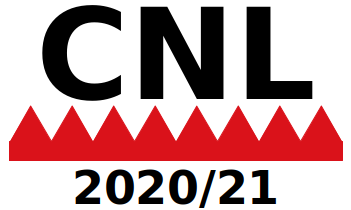

<!--

<a href="cnl2018program.html">Program</a> | <a href="cnl2018pd.html">Posters/Demos</a> | <a href="cnl2018speakers.html">Invited Speakers</a>  | <a href="cnl2018info.html">Info for Participants</a> | <a href="cnl2018SM.html">Social Media</a>

-->

Seventh International Workshop on Controlled Natural Language (CNL 2020/21)

<strong>in the week of 6 September 2021 — Amsterdam, Netherlands</strong>

<strong>Co-located with <a href="https://2021-eu.semantics.cc/">SEMANTiCS 2021</a></strong>

<!--

Sponsors:

-->

[The workshop was originally planned for 2020 but was postponed to 2021 due to Covid-19.]

This workshop on [Controlled Natural Language (CNL)](index.html) has a broad
scope and embraces all approaches that are based on natural language and apply
restrictions on vocabulary, grammar, and/or semantics. This includes (but is
certainly not limited to) approaches that have been called _simplified language,
plain language, formalized language, processable language, fragments of
language, phraseologies, conceptual authoring, language generation, and guided
natural language interfaces_.

Some CNLs are designed to improve communication among humans, especially for
non-native speakers of the respective natural language. In other cases, the
restrictions on the language are supposed to make it easier for computers to
analyze such texts in order to improve computer-aided, semi-automatic, or
automatic translations into other languages. A third group of CNL has the goal
to enable reliable automated reasoning and formal knowledge representation from
seemingly natural texts. All these types of CNL are covered by this workshop.

### Important Dates

- paper submission deadline: 2 May 2021
- notification of acceptance: 15 June 2021
- camera-ready papers: 5 July 2021
- workshop: two days in the week of 6 September 2021 (tba)

### Venue and Registration

The workshop will be at the [Meervaart Theatre in Amsterdam](https://2020-eu.semantics.cc/venue), together with the SEMANTiCS conference.

<!--
You can register via the [SEMANTiCS registration system](https://2020-eu.semantics.cc/prices). The "CNL only" option costs €200, plus €42 taxes. (If you cannot afford this, contact us and we will see what we can do for you.)
-->

### Sponsors

_(contact Silvie Spreeuwenberg, silvie@librt.com, if you want to become a sponsor)_

### Topics

Possible topics for CNL 2020 include:

- CNL for knowledge representation
- CNL for query interfaces
- CNL for specifications
- CNL for business rules
- CNL for dialogue systems
- CNL for machine translation
- CNL for improved understandability of texts
- CNL for natural language generation
- design of CNLs
- CNL applications
- CNL evaluation
- usability and acceptance of CNL
- CNL grammars and lexica
- multilingual CNLs
- reasoning in CNL
- spoken CNL
- CNL in the context of the Semantic Web and Linked Open Data
- CNL in the government
- CNL in industry
- CNL use cases
- theoretical properties of CNL

### Submissions and Proceedings

We invite researchers to submit papers with novel contributions in the area of CNL. We are looking for two types of papers, formatted in two-column ACL style:

- Full papers with novel research results and/or in-depth case descriptions should not exceed 8 pages (accepted papers will get a long presentation slot at the workshop)
- Short papers (including demo/white papers) that shortly introduce a system, approach, or opinion should not exceed 4 pages (accepted papers will get a shorter presentation slot at the workshop)

<!--
Submission should be done via EasyChair [here](https://easychair.org/conferences/?conf=cnl2020). Full and short paper will be peer-reviewed, and accepted papers will be published in the [ACL Anthology](https://www.aclweb.org/anthology/).
-->

There will also be a business track, for which you can submit extended abstracts:

- Business track abstracts of 1 or 2 pages (excluding graphics) describing a business application or business case (accepted abstracts will get a presentation slot in the business track session)

### Keynote Speakers

- Bob Kowalski, Imperial College London
- Piek Vossen, VU Amsterdam
- Mariette Lokin, Douane Nederland

### Organization Committee

- Tobias Kuhn, VU Amsterdam, Netherlands
- Silvie Spreeuwenberg, LibRT, Netherlands
- Stijn Hoppenbrouwers, HAN University of Applied Sciences and Radboud University, Netherlands
- Norbert E. Fuchs, University of Zurich, Switzerland 

### Program Committee

- Krasimir Angelov (Digital Grammars, Sweden)
- Mihael Arcan (National University of Ireland, Galway)
- John Camilleri (Digital Grammars, Sweden)
- Brian Davis (Maynooth, Co Kildare, Ireland)
- Ronald Denaux, (Expert System, Spain)
- Ramona Enache (Microsoft, Sweden)
- Sebastien Ferre (University Rennes 1, France)
- Antske Fokkens (VU Amsterdam, Netherlands)
- Albert Gatt (University of Malta)
- Normunds Gruzitis (University of Latvia)
- Yannis Haralambous (IMT Atlantique, France)
- Herbert Lange (University of Gothenburg, Sweden)
- Kaarel Kaljurand (Nuance Communications, Austria)
- Maria Keet (University of Cape Town, South Africa)
- John P. McCrae (National University of Ireland, Galway)
- Roser	Morante	(VU Amsterdam, Netherlands)
- Gordon Pace (University of Malta)
- Laurette Pretorius (University of South Africa, South Africa)
- Rolf Schwitter (Macquarie University, Australia)
- Giovanni Sileno (University of Amsterdam, Netherlands)
- Irina Temnikova (Qatar Computing Research Institute, Qatar)
- Mike Rosner (University of Malta)
- Camilo Thorne (Elsevier, Germany)
- Adam Wyner (Swansea University, UK)

### Previous Events

There were six previous events in the same series:

- [CNL 2009](http://attempto.ifi.uzh.ch/site/cnl2009/) in Marettimo, Italy
- [CNL 2010](http://staff.um.edu.mt/mros1/cnl2010/index.html) in Marettimo, Italy
- [CNL 2012](http://attempto.ifi.uzh.ch/site/cnl2012/) in Zurich, Switzerland
- [CNL 2014](http://attempto.ifi.uzh.ch/site/cnl2014/) in Galway, Ireland
- [CNL 2016](http://www.sigcnl.org/cnl2016.html) in Aberdeen, Scotland
- [CNL 2018](http://www.sigcnl.org/cnl2018.html) in Maynooth, Ireland

